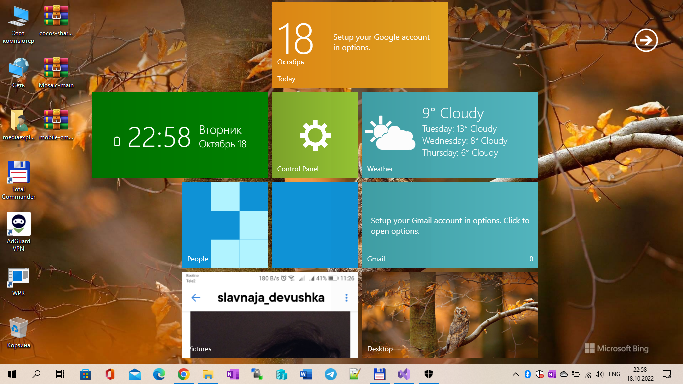

# Mosaic2022

Mosaic is the windows shell (app) that helps you access your favorite tools, webpages 
and other features from a single panel with the aid of a Windows 8 Start screen-like GUI

The original was made by Stealh2012 (developer nichname) in 2010-2011 years and shared at CodePlex. 
Then this project was totally lost. I'll try to do some remake (new metro cells, etc.). 

### Screenshots
<table><tr>
<td>  </td>
</tr></table>

### My sweet old video from Youtube (2011)

https://www.youtube.com/watch?v=U0Hr9-C8WhE

## What's new
- Redesigned toolbar
- Redesigned options
- Added option to set picture to the Mosaic background
- Added option to enable shadow under the widgets

## Description 
Mosaic is a small desktop enhancement utility designed specifically for Windows 10/11 users 
in order to bring the Start screen implemented in Windows 8 to their desktop.

* Clean layout

The program gives you the possibility to create several tiles which give you access to different system functions or webpages. 
The tiles can be dragged and dropped to the preferred position in the working environment.

You can run the utility in full screen mode for a better visualization of the tiles. By default, it shows a widget with the date/time.

* Set up multiple tiles
Mosaic helps you create tiles which allow quick access to different options, such as Control Panel, Desktop, Gmail, Music, Pictures, Twitter, Video, and Weather. Deleting tiles can be done by dragging the target widget over the recycle icon. What’s more, you can add custom applications, webpages, and Facebook friends as tiles.

* A few configuration settings
The tool hides several configuration settings under the hood for helping you change the background color of the working environment, enable the full screen mode and widget animation, as well as show or hide the menu button.

Tests have shown that Mosaic delivers a clean and well-organized layout where you can store your favorite Windows 8-like tiles. However, it crashed several times while trying to add programs as tiles. It eats up CPU and memory so you need a strong computer in order to be able to work with it.

## Bottom line
All things considered, Mosaic delivers a simple software solution for helping you access your favorite tools, webpages and other features from a single panel with the aid of tiles. The configuration process is easy to decode even by less experienced users.

AS IS. RnD only. No support.

-- [m][e] 2022