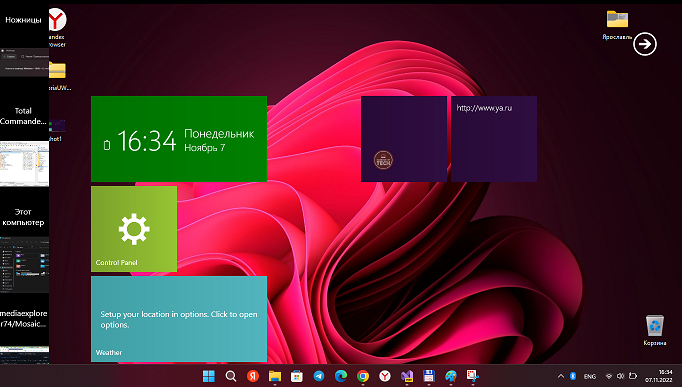

# Mosaic2022

Mosaic is the windows shell (app) that helps you access your favorite tools, webpages 
and other features from a single panel with the aid of a Windows 8 Start screen-like GUI

## About
The original was made by Stealh2012 (Artem Shuba) in 2010-2011 years and shared at CodePlex. 
Then this project was totally lost. I'll try to do some remake (new metro cells, etc.). 

### Screenshots
<table><tr>
<td>  </td>
<td>  </td>
</tr></table>

### My old video from Youtube (2011)

## What's new
- Left Thabnails Bar fixed
- Redesigned options
- Added option to set picture to the Mosaic background
- Added option to enable shadow under the widgets

## Description 
Mosaic is a small desktop enhancement utility designed specifically for Windows 10/11 users 
in order to bring the Start screen implemented in Windows 8 to their desktop.

* Clean layout

The program gives you the possibility to create several tiles which give you access to different system functions or webpages. 
The tiles can be dragged and dropped to the preferred position in the working environment.

You can run the utility in full screen mode for a better visualization of the tiles. By default, it shows a widget with the date/time.

* Set up multiple tiles
Mosaic helps you create tiles which allow quick access to different options, such as Control Panel, Desktop, Gmail, Music, Pictures, Twitter, Video, and Weather. Deleting tiles can be done by dragging the target widget over the recycle icon. What’s more, you can add custom applications, webpages, and Facebook friends as tiles.

* A few configuration settings
The tool hides several configuration settings under the hood for helping you change the background color of the working environment, enable the full screen mode and widget animation, as well as show or hide the menu button.

Tests have shown that Mosaic delivers a clean and well-organized layout where you can store your favorite Windows 8-like tiles. However, it crashed several times while trying to add programs as tiles. It eats up CPU and memory so you need a strong computer in order to be able to work with it.

## Bottom line
All things considered, Mosaic delivers a simple software solution for helping you access your favorite tools, webpages and other features from a single panel with the aid of tiles. The configuration process is easy to decode even by less experienced users.

## References
- https://www.trishtech.com/2011/09/add-windows-8-metro-interface-to-windows-7-with-the-mosaic-project/
- https://github.com/artemshuba  Artem Shuba's GitHub world
- https://links.giveawayoftheday.com/mosaicproject.codeplex.com

##.
AS IS. RnD only. No support.

- [m][e] 2022

# Мозаика2022

Mosaic - это оболочка Windows (приложение), которая помогает вам получить доступ к вашим любимым инструментам, веб
-страницам и другим функциям с одной панели с помощью графического интерфейса, похожего на начальный экран Windows 8.

## Об этом проекте

Оригинал сего проекта был сделан разработчиком с ником Stealh2012 в 2010-2011 годах и опубликован на CodePlex.
Затем этот проект был полностью потерян. Я попытаюсь сделать какой-нибудь ремейк (новые "ячейки" (встроенные элементы) в метро-плитках и т.д.).

### Скриншоты
<table><tr>
<td>  </td>
<td>  </td>
</tr></table>

### Мое старое видео с Youtube (2011)

## Что нового
- Левая панель ярлыков приложений исправлена
- Переработанные опции
- Добавлена возможность установить картинку на фон мозаики
- Добавлена опция для включения тени под виджетами

## Описание
Mosaic - это небольшая утилита для улучшения рабочего стола, разработанная специально для пользователей Windows 10/11, чтобы перенести Начальный экран, реализованный в Windows 8, на их рабочий стол.

* Чистый макет

Программа дает вам возможность создать несколько плиток, которые дают вам доступ к различным системным функциям или веб-страницам.
Плитки можно перетаскивать в нужное положение в рабочей среде.

Вы можете запустить утилиту в полноэкранном режиме для лучшей визуализации плиток. По умолчанию он показывает виджет с датой/временем.

* Настройка нескольких плиток
Мозаика помогает создавать плитки, которые обеспечивают быстрый доступ к различным опциям, таким как Панель управления, Рабочий стол, Gmail, Музыка, Картинки, Twitter, Видео и Погода. Удаление плиток можно выполнить, перетащив целевой виджет на значок корзины. Более того, вы можете добавлять пользовательские приложения, веб-страницы и друзей на Facebook в виде плиток.

* Несколько параметров конфигурации
Инструмент скрывает под капотом несколько настроек конфигурации, которые помогут вам изменить цвет фона рабочей среды, включить полноэкранный режим и анимацию виджета, а также показать или скрыть кнопку меню.

Тесты показали, что Mosaic обеспечивает чистый и хорошо организованный макет, в котором вы можете хранить свои любимые плитки, похожие на Windows 8. Однако при попытке добавить программы в виде плиток он несколько раз "выходил из строя", то есть вылетал. И этот проект активно потребляет процессор и память, поэтому вам нужен мощный компьютер, чтобы иметь возможность с ним работать.

## Итог
Учитывая все обстоятельства, Mosaic предоставляет простое программное решение, которое поможет вам получить доступ к вашим любимым инструментам, веб-страницам и другим функциям с одной панели с помощью плиток. Процесс настройки легко расшифровывается даже менее опытными пользователями.

## Ссылки
- https://www.trishtech.com/2011/09/add-windows-8-metro-interface-to-windows-7-with-the-mosaic-project/
- https://github.com/artemshuba  Мир разработчика Артема Шуба Artem на GitHub
- https://links.giveawayoftheday.com/mosaicproject.codeplex.com

## .
AS IS. Только для RnD. Никакой поддержки.

- [м][е] 2022